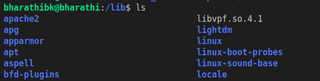
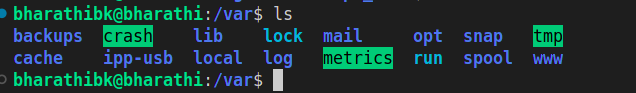
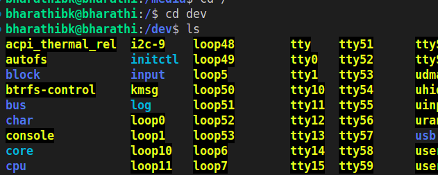
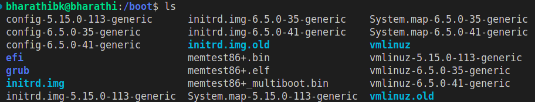

# The main directories in the linux file system

# /bin

# When you run ls on your Linux terminal, the following sequence of events happens:

Command Capture: The shell captures your command. It reads the command and checks if it is executable.

Command Search: The shell searches for the command in directories listed in the PATH environment variable, which commonly includes /bin. This directory contains many executable binaries.

# For example, commands for file operations (ls, cp, mv), text processing (echo, grep, sed), and system monitoring (ps, top) are stored in /bin.
Shell Definition: The shell is a command line interface that allows you to interact with the operating system.

Command Execution: The shell executes the command found in the /bin directory. This involves two system calls: fork() and exec().

fork() System Call: This creates a clone of the current process. The shell is the parent process, and the cloned process is the child.

exec() System Call: This replaces the child process created by fork() with the new process (in this case, the ls command).

# Example: When you open a terminal and execute the ls command, the shell runs the command. If you open multiple terminals and run commands simultaneously, fork() creates copies of the shell process, and exec() turns these copies into new processes. This way, multiple commands can be executed simultaneously without affecting the original shell process.

Directory Listing: The new ls process calls the opendir() and readdir() system calls to read the contents of the current directory.

Formatting Output: The ls program formats the directory entries for display, sorts them alphabetically by default, and prepares the output.

Output Display: The ls program writes the formatted output to the standard output (stdout), which is your terminal. This is done using the write() system call.

Process Termination: Once everything is completed, the exit() system call is executed to terminate the process.

# /etc

The /etc folder in Linux is like a central hub for configuration files.

# Purpose: The /etc directory contains all the configuration files and shell scripts used by various programs and the operating system.
Think of it as: A folder full of instructions that tell your computer how to behave and how different programs should run.

# simple term :

when you are install any application on your ubuntu machine 

the configuration files of the application will stored in /etc

# what is configuration file ?

# example : when you install jenkins on your local, jenkins has some configuration file that file contains all the jenkins related configiration like which port jenkins run and where jenkins log will store these all are configuration. 

# /lib 

In Linux systems, the /lib directory primarily contains essential shared library files (also known as dynamically linked libraries or shared objects) that are crucial for the functioning of programs and the operating system itself. 

# Purpose: Programs in Linux often use these shared libraries to perform tasks such as reading files, connecting to networks, or displaying graphics. Each library file contains specific functions that programs can call upon when needed.

# example : when you write a code in python you may use many modules depends up on your usecase those modules are lib in linux.

# /media

Media typically refers to storage devices such as USB drives, DVDs, or any external storage medium used for data storage and transfer.

# Purpose: /media this folder managing the external drive such as usb drive or dvd 

# Example: if you insert  pendrive  on your machine you can access your pendrive from this folder /media

# /var

The /var directory in Linux is crucial for system operation and contains variable data that often changes during the course of system operation

# there are four important folders :

/var/log , /var/run ,  /var/temp , /var/spool

# Purpose : on your machine if you do any action like download files or execute any program those logs will be stores in /var folder

# /var/log: 
this folder contains all the logs like system logs or application logs

# /var/temp:
this folder contains all the temporary file like download catch logs 

# /var/run:
this folder contains all the live run time data (logs)pid or process

# /var/spool:
this folder contains all the queuing related data like printer or scheduling taks's

# /dev

/dev is a special directory in Linux that holds files representing your computer’s hardware devices and some virtual devices.

/dev stands for devices

# Purpose: /dev is a directory full of special files that act like shortcuts to your computer’s hardware and some special functions.
It helps your computer talk to its hardware devices in a simple and standardized way.

# Example : Press a Key:

When you press a key on your keyboard, the signal goes to your computer.
/dev/tty:

The special file /dev/tty is involved. This file represents the terminal, which is like the link between your keyboard and screen.
What /dev/tty Does:

It receives the signal from your keyboard.
It sends this signal to the appropriate place, such as a text editor or the command line.
It also sends back the output to your screen so you can see what you typed.

# /boot 

# Purpose : one of the very important folder in linux where kernel and inirfs and grub  are located 

# example : when you turn on your linux machine what will happen ?

# step 1 : Turning on my laptop
# step 2 : first call basicinputoutputsystem(bios) or (unified exetensiable firmware interface)  made a post request to bios/uefi will check the hardware ram and memory if everything works fine it will call grub
# step 3: what is grub? grand unified bootloader this file also located in /boot  These files tell GRUB where to find the kernel and initial RAM disk, and how to start them.
# step 4: login page 

# kernel : The kernel is the core part of the operating system.
It manages everything your computer does, like running programs and talking to hardware.

In Simple Terms:
Think of the kernel as the "brain" of your computer.

# What is the Initial RAM Disk?
The initial RAM disk is a temporary filesystem loaded into memory during boot.
It contains drivers and scripts needed to set up the system before the main filesystem is available.

# What is the Bootloader?
The bootloader is a small program that starts when you turn on your computer.
It loads the kernel and initial RAM disk into memory and starts the operating system.

In Simple Terms:
The bootloader is like a “starter” for your car. It gets the engine (kernel) running.
