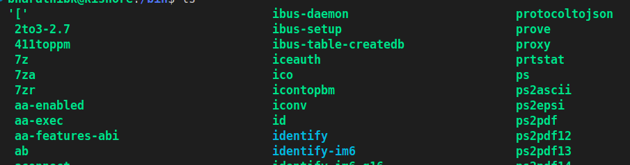
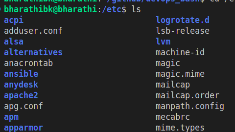

# The main directories in the linux file system

# /bin

# When you run ls on your Linux terminal, the following sequence of events happens:

Command Capture: The shell captures your command. It reads the command and checks if it is executable.

Command Search: The shell searches for the command in directories listed in the PATH environment variable, which commonly includes /bin. This directory contains many executable binaries.

# For example, commands for file operations (ls, cp, mv), text processing (echo, grep, sed), and system monitoring (ps, top) are stored in /bin.
Shell Definition: The shell is a command line interface that allows you to interact with the operating system.

Command Execution: The shell executes the command found in the /bin directory. This involves two system calls: fork() and exec().

fork() System Call: This creates a clone of the current process. The shell is the parent process, and the cloned process is the child.

exec() System Call: This replaces the child process created by fork() with the new process (in this case, the ls command).

# Example: When you open a terminal and execute the ls command, the shell runs the command. If you open multiple terminals and run commands simultaneously, fork() creates copies of the shell process, and exec() turns these copies into new processes. This way, multiple commands can be executed simultaneously without affecting the original shell process.

Directory Listing: The new ls process calls the opendir() and readdir() system calls to read the contents of the current directory.

Formatting Output: The ls program formats the directory entries for display, sorts them alphabetically by default, and prepares the output.

Output Display: The ls program writes the formatted output to the standard output (stdout), which is your terminal. This is done using the write() system call.

Process Termination: Once everything is completed, the exit() system call is executed to terminate the process.

# /etc

The /etc folder in Linux is like a central hub for configuration files.

# Purpose: The /etc directory contains all the configuration files and shell scripts used by various programs and the operating system.
Think of it as: A folder full of instructions that tell your computer how to behave and how different programs should run.

# simple term :

when you are install any application on your ubuntu machine 

the configuration files of the application will stored in /etc

# what is configuration file ?

# example : when you install jenkins on you local jenkins has some configuration file that file contains all the jenkins related configiration like which port jenkins run and where jenkins log will store these all are configuration 

