# top 100 commands in linux

# Command 1
# ls (list the contents of folder)

# ls === > list command
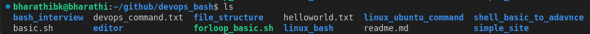
# ls -a ==== > list the contents with hidden files or folders
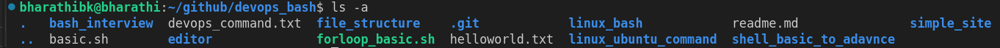
# ls -l ==== > list the contents in long format
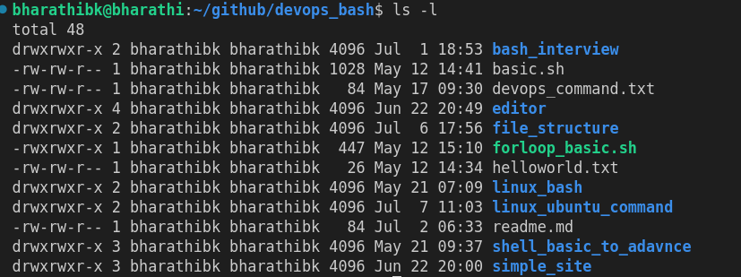
# ls -la ==== > list the contents with long format and hidden files or folders
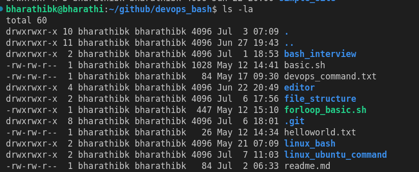
# ls -lh ==== > list the contents with long format and human readable data

# ls -r  ==== > list the contents in revers order
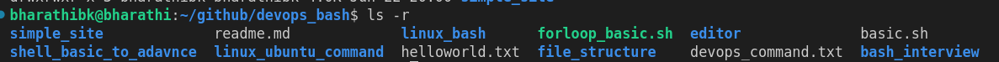
# ls -R  ==== > list the contents with recursive mode 
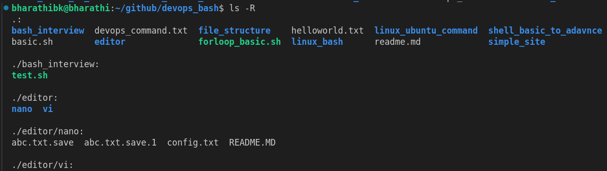
# ls -t  ==== > list the contents with latest modification
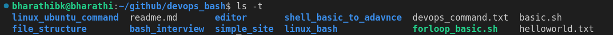
# ls --color ==== > list the contents with diffrent colors
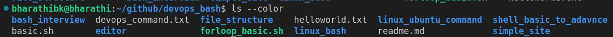
# ls -F  ==== > list the contents with classify files
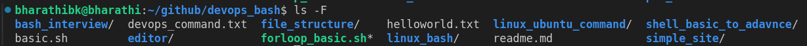

# Command 2
# Uptime (The uptime command in Linux is a powerful tool that displays the current time, the system's uptime, the number of users, and the load average)

# uptime
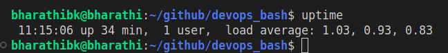

# uptime --help
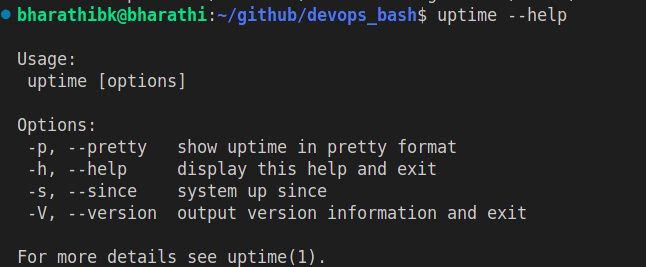

# uptime -s (system up since)
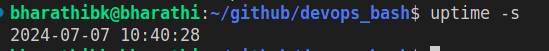

# uptime -p (show uptime in pretty format)
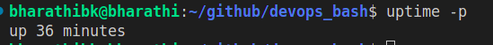

# Command 3

# pwd (present working directory)
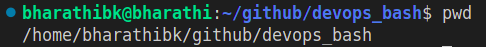

# Command 4

# cd (change directory)
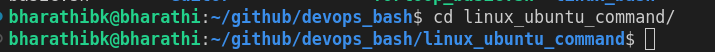

# cd - (change directory do and undo)
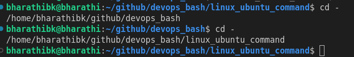

# cd .. (change directory one folder back)
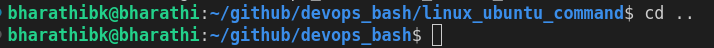

# cd ../.. (change directory two folder back)
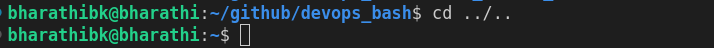

# cd ~ (change directory   home)
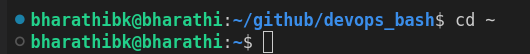

# cd $env_variable
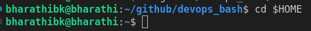

