# top 100 commands in linux

# Command 1
# ls (list the contents of folder)

# ls === > list command

# ls -a ==== > list the contents with hidden files or folders

# ls -l ==== > list the contents in long format

# ls -la ==== > list the contents with long format and hidden files or folders

# ls -lh ==== > list the contents with long format and human readable data

# ls -r  ==== > list the contents in revers order

# ls -R  ==== > list the contents with recursive mode 

# ls -t  ==== > list the contents with latest modification

# ls --color ==== > list the contents with diffrent colors

# ls -F  ==== > list the contents with classify files

# Command 2
# Uptime (The uptime command in Linux is a powerful tool that displays the current time, the system's uptime, the number of users, and the load average)

# uptime

# uptime --help

# uptime -s (system up since)

# uptime -p (show uptime in pretty format)

# Command 3

# pwd (present working directory)

# Command 4

# cd (change directory)

# cd - (change directory do and undo)

# cd .. (change directory one folder back)

# cd ../.. (change directory two folder back)

# cd ~ (change directory   home)

# cd $env_variable

# command 5

# mkdir(make directory)
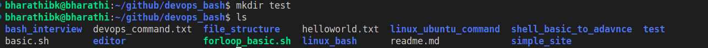

# mkdir -v directory_name(-v verbose)
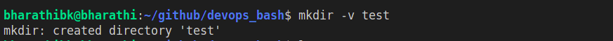

# mkdir -m 700 directory_name(-m mode )

# command 6 

# rmdir(remove directory) 

# rmdir -v directory_name or rmdir directory_name
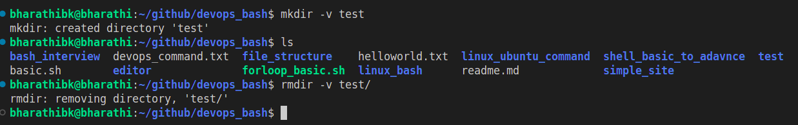

# command 7 

# touch file_name (create a empty file)
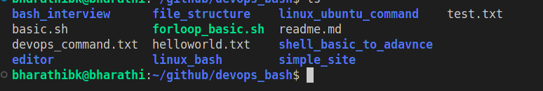

# touch -a (change only the access time of a file)

# touch -m (change only the modification time of a file )

# touch -d (specific date of time)
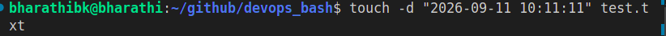

# touch -r (the timestamps from a reference file)

# command 8 

# rm (remove command)

# rm file_name  or rm -r folder_name , file_name
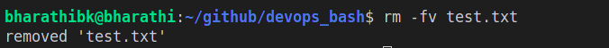

# command 9 

# cp (copy the file or folder)
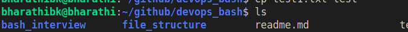

# cp file_name distination_folder_name

# cp -r source_folder_name distination_folder_name  (copy a directory)

# command 10

# mv (move the folder or file or rename the files or folders)

# mv old_file_name  new_file_name(rename the file)
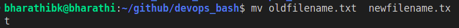

# mv file distination_folder(move the file to foler)

# mv source_folder distination_folder(move the directory)
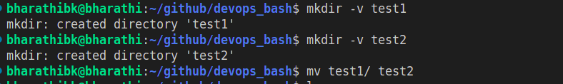

# command 11

# cat file_name(concatenate and display file content)
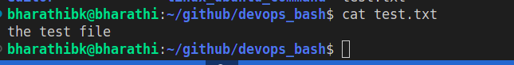

# cat -n (number all output lines of files)
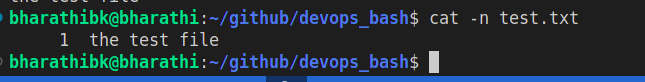

# cat -E (Display end of lines in a file)
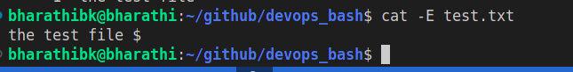

# command 12
# more file_name & less file_name & head file_name & tail file_name

# more file_name (view file content one screen at a time)

# less file_name (view file content with forward and backward navigation)

# head file_name (display beginning of the file)
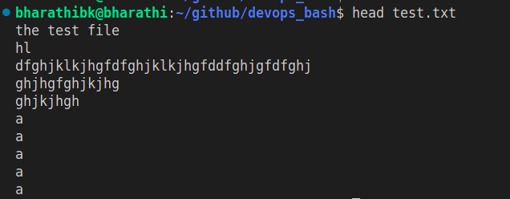

# tail file_name (display the end of a file)
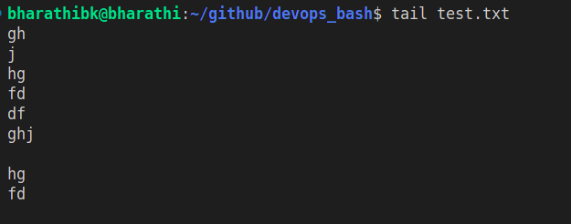

# command 13

# echo (print command in linux)
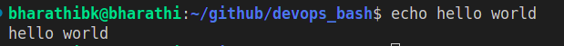

# command 14 

# man (display manual for a command)

# info (display more detailed documentation for a command)

# command 15 

# find [path] [options] file_name

# find /path/of/the/file -name filename.txt(find the file inside the directory)
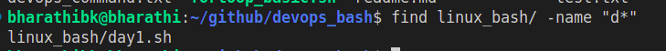

# find /path/of/the/dirctory -type d -name "a*"(find the directory inside the directory)
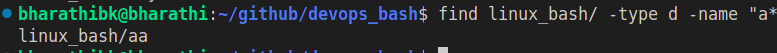

# find /path/of/the/file  -size -100M (find the file lesser than 100mb)
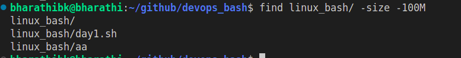

# find /path/of/the/file -mtime -7 (find files modified in the last 7 days)
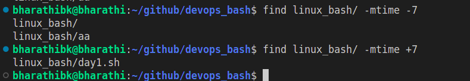

# find /path/of/the/file -perm 775 (find file with permission 775)
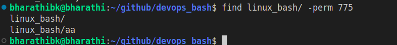

# command 16 

# grep (global regular expression print)

# grep -w search_word file_name(match whole words only)
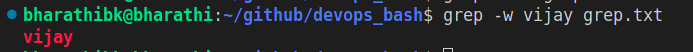

# grep -i search_word file_name(ignore case(case insensitive))
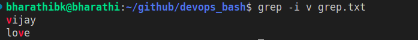

# grep -v search_word file_name(invert match (select non matching lines))
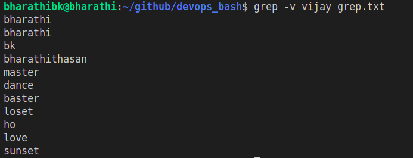

# grep -r search_word folder_name(recursively serach directories)
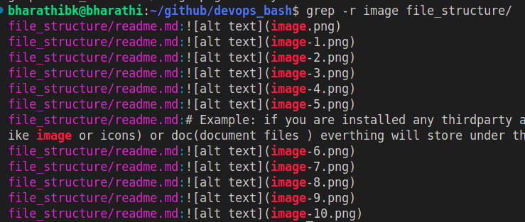

# grep -l search_word file1_name file2_name(Print only the names of files with matching lines.)
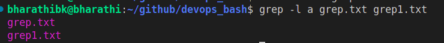

# grep -n search_word file1_name (print line number with output lines)
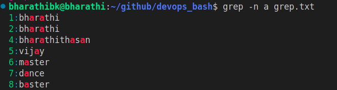

# grep -c search_word file1_name (count the number of matching lines)
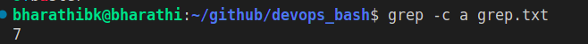

# very important commands

# command 17 

# useradd user_name(create a new user)

# useradd -m username(Creating a User with a Home Directory)

# passwd user_name (set the user password)

# userdel -r user_name (remove the user and user home directory)

# sudo usermod -aG sudo user_name (make the user as admin by using this command i am adding the sudo to test user group (use this command to verify ## groups username))

# command 18 

# sudo groupadd group_name      (create a group)
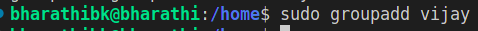

# sudo groupdel group_name      (delete the group)
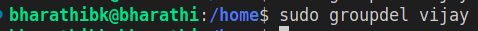

# command 19 

# chmod  (Change File Modes or Permissions)
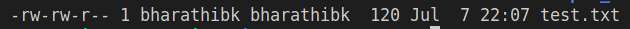

# r (read), w(write),x(execute)
# r == value 4
# w == value 2
# e == value 1

# full value (-rw-rw-r) first -rw- owner(u), second -rw- group(g) , -r other user(o)

# chmod 600 file_name (600 mean 4+2 4 is read 2 is write)

# chmod 777 file_name(4+2+1=7(u),7(g),7(o))

# command 20 

# chown(Change File Owner and Group)

# above image has two names bharathibk (first one is user and second one is group)

# chown user_name file_name(change the owner of this file)

# chown :groupname file_name (change the group of this file)

# chown user_name:group_name (change the both user name and group name of this file)

# chown -R username /path/of/the/directory (change the owner of the directory)

# command 21

# chgrp Change Group Ownership

# chgrp group_name file_name(using this command we can change the file or directory group ownership note: we can also use chown to change the group ownership)

# chgrp -R group_name dirctory_name (Changing group ownership recursively for a directory)

# command 22

# ln (ln - Create hard and symbolic links)
# hard link
A hard link is like having multiple names for the same file. Any changes made to one name (or link) affect all the other names (links).

# Symbolic Links
 
A symbolic link is like a shortcut or a pointer to another file or directory. If you delete or move the original file, the symbolic link becomes broken and doesn't point to anything anymore.

# ln original_file_name  hard_link_file_name(create a hard link)

# ln -s  original_file_name symbolic link name(create a symbolic link)

# ln -sf (overwrites existing links or files)

# ln -sv (prints detailed information)

# command 23

# df (disk free)

The df command in Linux is used to display information about disk space usage on mounted filesystems. It stands for "disk free" and provides details such as total space, used space, available space, and filesystem type for each mounted filesystem.

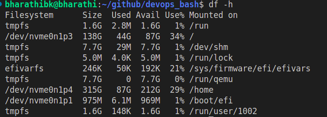

# df -h (human readable)

# df -T (print file system type of each file system)

# df -i (display inode information)

# df -a ( Include pseudo filesystems (like /proc and /sys) in the output.)

# df --total (Display a total line at the end summarizing the total disk space usage across all filesystem)

# command 24

# du(disk usage)

the du command in Linux stands for "disk usage" and is used to estimate file and directory space usage. It recursively summarizes disk usage of each specified file and directory and their subdirectories

# du -h (find current directory disk usage in human readable format)

# du -sh (Display only a total for each argument)

#  command 25

# free (display information about system memory) 

# free -h (human readable)
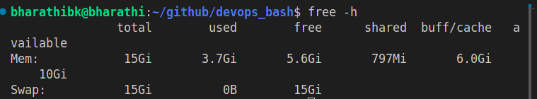

# free -hs 1 (display memory info every second)

# command 26 

# ps(process)
The ps command in Linux is used to list currently running processes on a system. It provides a snapshot of active processes along with detailed information about each process. 

# ps -e(diplay information about all process)
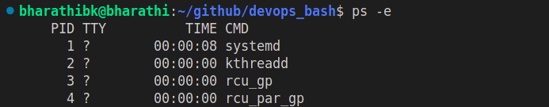

# ps -ef(diplay more information)

# ps -aux (diplay all user information with all process)

# command 27

# top 
The top command in Linux is a powerful utility that provides a real-time view of the system’s processes, displaying information about CPU and memory usage, as well as the state of individual processes.

# top 

# top -d 1(updates every 1 seconds)

# top -u user_name(Displays processes for a specific user only.)

# top -p pid_id(Monitor specific process IDs)

# top -o specfic_fields( Specifies the field to sort by initially. Fields can be pid, user, pr, ni, virt, res, shr, %cpu, %mem, time+)

# command 28

# kill
The kill command is used to terminate or send signals to processes based on their process ID (PID).

# kill process_id (soft kill)
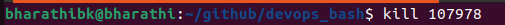

# kill -9 process_id (hard kill)
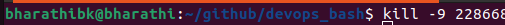

# killall(The killall command terminates processes by their name rather than their PID.)
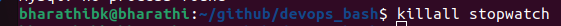

# pkill -u username process_name

# command 29 

The ssh command is used to securely connect to a remote machine or server over a network. It stands for Secure Shell and is a widely used tool for remote administration, secure file transfers, and tunneling.

# ssh (open ssh client (remote login program))

# ssh user_name@ip_address

# ssh -p port_number user_name@ip_address(using a diffrent port)

# ssh -i private_key user_name@ip_address (using ssh key)

# ssh -L 8080:localhost:80 user@ip_address(local port foewarding)

# ssh -R 8080:localhost:80 user@ip_address(remote port forwarding)

# command 30 

The scp (secure copy) command is used to securely transfer files and directories between local and remote systems over a network. It uses SSH for data transfer, providing the same level of security and authentication as SSH.

# scp file_name user_name@ip_address:/home/path/(copy a local file to a remort system)

# scp user_name@ip_address://home/path/file /local/directory/ (coping  a remote file to the local system)

# scp -r /local/path/directoty user_name@user_ipaddress:/home/path/(copying a directory recursively)

# scp -p 2222 file user_name@ip_address:/home/path/(specifying port)

# scp -i path_of_the_key/private.pem file_name user_name@ip_address:/home/path/

# command 31

rsync is a versatile and powerful tool for file synchronization and transfer. It is highly efficient, especially for large files and directories, because it only transfers the differences between the source and destination. With options for compression, deletion, and exclusion, rsync can be tailored to fit a wide range of file transfer and synchronization needs.

# rsync -avz /local/directory user_name@ip_address:/home/directory/

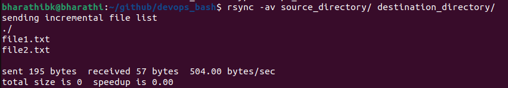

# rsync -avz --delete /directory/ user_name@ip_address:/home/path(Deleting Extraneous Files from Destination)

# rsync -avz --exclude 'file_name' /local/directory/ user_name@ip_address:/home/directorty/(Excluding Specific Files)

# command 32 

# wget

wget is a command-line utility for downloading files from the web. It is non-interactive, meaning it can work in the background while the user is not logged on. This makes it particularly useful for downloading large files or recursively downloading directories, websites, or mirroring websites.

# wget url_of_the_website

# wget -P /directory/  url_of_the_webiste(Downloading a File to a Specific Directory
)

# wget -c url_of_the_website(Resuming a Partially Downloaded File)

# wget -r url_of_the_webiste(Downloading a Directory Recursively)

# command 33

# curl 
curl is a command-line tool used for transferring data with URLs. It supports a wide range of protocols including HTTP, HTTPS, FTP, and more. curl is often used for downloading files, interacting with APIs, and testing endpoints.

# curl -O url(Downloading a File)

# curl -o file_name url(Saving a File with a Specific Name)
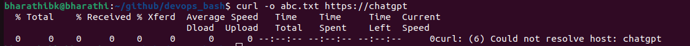

# curl -X GET url(Sending a GET Request)

# curl -X POST -d "name=John&age=30" http://example.com/form (Sending a POST Request with Data)

# curl -u user_name:password http://example.com(Using Basic Authentication)

