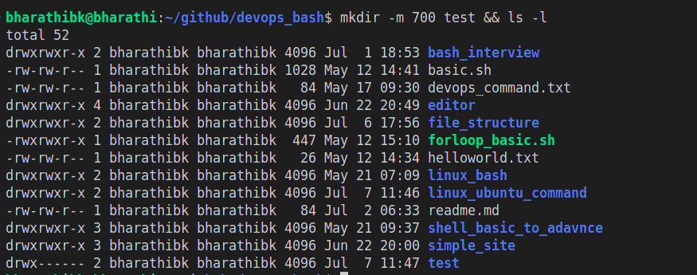
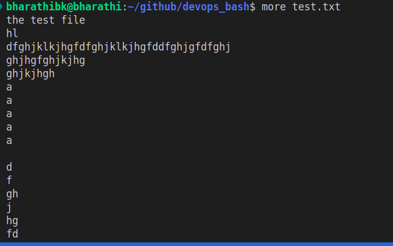
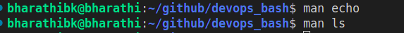

# top 100 commands in linux

# Command 1
# ls (list the contents of folder)

# ls === > list command

# ls -a ==== > list the contents with hidden files or folders

# ls -l ==== > list the contents in long format

# ls -la ==== > list the contents with long format and hidden files or folders

# ls -lh ==== > list the contents with long format and human readable data

# ls -r  ==== > list the contents in revers order

# ls -R  ==== > list the contents with recursive mode 

# ls -t  ==== > list the contents with latest modification

# ls --color ==== > list the contents with diffrent colors

# ls -F  ==== > list the contents with classify files

# Command 2
# Uptime (The uptime command in Linux is a powerful tool that displays the current time, the system's uptime, the number of users, and the load average)

# uptime

# uptime --help

# uptime -s (system up since)

# uptime -p (show uptime in pretty format)

# Command 3

# pwd (present working directory)

# Command 4

# cd (change directory)

# cd - (change directory do and undo)

# cd .. (change directory one folder back)

# cd ../.. (change directory two folder back)

# cd ~ (change directory   home)

# cd $env_variable

# command 5

# mkdir(make directory)

# mkdir -v directory_name(-v verbose)

# mkdir -m 700 directory_name(-m mode )

# command 6 

# rmdir(remove directory) 

# rmdir -v directory_name or rmdir directory_name

# command 7 

# touch file_name (create a empty file)

# touch -a (change only the access time of a file)

# touch -m (change only the modification time of a file )

# touch -d (specific date of time)

# touch -r (the timestamps from a reference file)

# command 8 

# rm (remove command)

# rm file_name  or rm -r folder_name , file_name

# command 9 

# cp (copy the file or folder)

# cp file_name distination_folder_name

# cp -r source_folder_name distination_folder_name  (copy a directory)

# command 10

# mv (move the folder or file or rename the files or folders)

# mv old_file_name  new_file_name(rename the file)

# mv file distination_folder(move the file to foler)

# mv source_folder distination_folder(move the directory)

# command 11

# cat file_name(concatenate and display file content)

# cat -n (number all output lines of files)

# cat -E (Display end of lines in a file)

# command 12
# more file_name & less file_name & head file_name & tail file_name

# more file_name (view file content one screen at a time)

# less file_name (view file content with forward and backward navigation)

# head file_name (display beginning of the file)

# tail file_name (display the end of a file)

# command 13

# echo (print command in linux)

# command 14 

# man (display manual for a command)

# info (display more detailed documentation for a command)

# command 15 

# find [path] [options] file_name

# find /path/of/the/file -name filename.txt(find the file inside the directory)

# find /path/of/the/dirctory -type d -name "a*"(find the directory inside the directory)

# find /path/of/the/file  -size -100M (find the file lesser than 100mb)

# find /path/of/the/file -mtime -7 (find files modified in the last 7 days)

# find /path/of/the/file -perm 775 (find file with permission 775)

# command 16 

# grep (global regular expression print)

# grep -w search_word file_name(match whole words only)

# grep -i search_word file_name(ignore case(case insensitive))

# grep -v search_word file_name(invert match (select non matching lines))

# grep -r search_word folder_name(recursively serach directories)

# grep -l search_word file1_name file2_name(Print only the names of files with matching lines.)

# grep -n search_word file1_name (print line number with output lines)

# grep -c search_word file1_name (count the number of matching lines)

